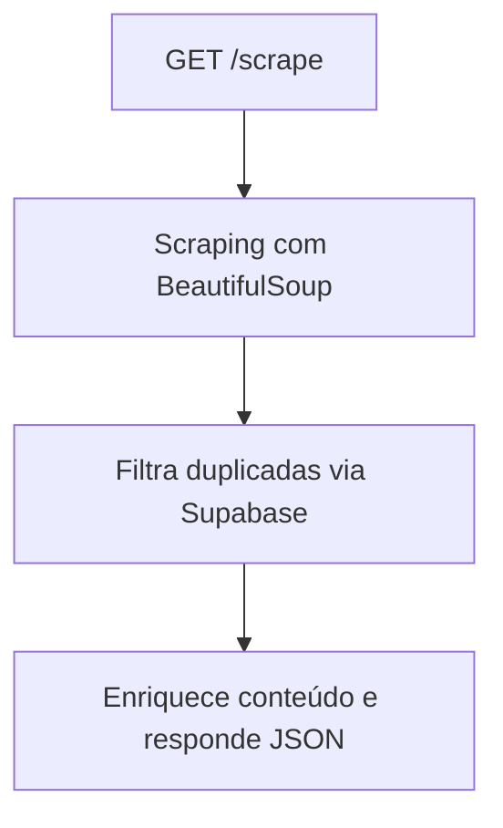

# 📰 OneFootball News Scraper API

API desenvolvida em Python com FastAPI para realizar scraping de notícias no site [OneFootball](https://onefootball.com).
Seu objetivo é extrair os **títulos**, **conteúdo** e **fontes** das notícias relacionadas a um time específico, retornando apenas as que ainda **não foram processadas**, com controle via Supabase.

---

## 🚀 Tecnologias Utilizadas

- **Python 3.10+**
- **FastAPI**
- **BeautifulSoup**
- **Requests**
- **Supabase**
- **Docker** (opcional)

---

## 📌 Endpoints da API

### `GET /scrape?link=URL_DO_TIME`

Coleta os metadados e o conteúdo das notícias de um time específico.

**Exemplo de requisição:**

```
GET /scrape?link=https://onefootball.com/pt/time/flamengo-383
```

**Exemplo de resposta:**

```json
{
  "novas_noticias": [
    {
      "titulo": "Flamengo divulga escalação para clássico",
      "fonte": "Globo Esporte",
      "link": "https://onefootball.com/pt/noticia/...",
      "noticia_id": "123456",
      "texto": "...",
      "data_publicacao": "2025-08-01T18:00:00"
    }
  ]
}
```

---

### `GET /health`

Verifica se a API está online.

**Resposta:**

```json
{ "status": "ok" }
```

---

## ⚙️ Como Rodar o Projeto

### 1. Clonar o repositório

```bash
git clone https://github.com/Wesleyslab/OneFootball-Scraper-API.git
cd OneFootball-Scraper-API
```

### 2. Instalar as dependências

```bash
pip install -r requirements.txt
```

### 3. Configurar variáveis de ambiente

Crie um arquivo `.env` com base em `.env.example`:

```env
SUPABASE_URL=https://<seu_projeto>.supabase.co
SUPABASE_KEY=chave_anon
API_KEY=sua_api_key_aqui
```

### 4. Rodar a API localmente

```bash
uvicorn main:app --reload
```

---

## 🐳 Usando Docker

```bash
docker build -t onefootball-api .
docker run -p 8000:8000 onefootball-api
```

---

## 🧠 Diagrama de Funcionamento



---

## 🧪 Testes

Execute os testes com:

```bash
python tester.py
```

---

## 🛠️ Configuração da Tabela no Supabase

### 1. Criar a tabela `noticias_onefootball`

| Coluna              | Tipo          | PK | Default               |
| ------------------- | ------------- | -- | --------------------- |
| `id`              | `uuid`      | ✅ | `gen_random_uuid()` |
| `noticia_id`      | `text`      | ❌ |                       |
| `titulo`          | `text`      | ❌ |                       |
| `link`            | `text`      | ❌ |                       |
| `fonte`           | `text`      | ❌ |                       |
| `time`            | `text`      | ❌ |                       |
| `data_criacao`    | `timestamp` | ❌ | `now()`             |
| `texto`           | `text`      | ❌ |                       |
| `data_publicacao` | `text`      | ❌ |                       |

### 2. Ativar RLS (Row Level Security)

- Vá em `Auth > Policies`
- Ative RLS e adicione uma policy `SELECT` permitindo leitura com o usuário `anon`

---

## 👨‍💻 Autor

Desenvolvido por **Wesley Alves**
[LinkedIn](https://www.linkedin.com/in/wesley-alves-data-engineer) • [GitHub](https://github.com/Wesleyslab)
