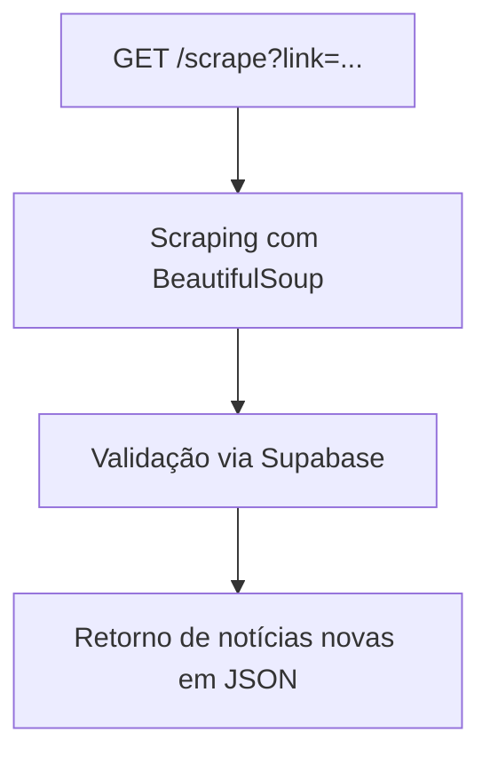

# 📰 OneFootball News Scraper API

API desenvolvida em Python com FastAPI para realizar scraping de notícias no site [OneFootball](https://onefootball.com).
Seu objetivo é extrair os **títulos, ** e **fontes** das notícias relacionadas a um time específico, retornando apenas o **conteúdo das notícias** que ainda **não foram processadas**, com controle via Supabase.

---

## 🚀 Tecnologias Utilizadas

- **Python 3.10+**
- **FastAPI**
- **BeautifulSoup** (HTML parsing)
- **Requests**
- **Supabase** (armazenamento de histórico)
- **Docker** (opcional para deploy local)

---

## 📌 Funcionalidades da API

### `GET /scrape?link=URL_DO_TIME`

Realiza scraping da página de notícias de um time e retorna apenas as notícias ainda não registradas no Supabase.

**Exemplo:**

```
GET /scrape?link=https://onefootball.com/pt/time/flamengo-383
```

**Resposta:**

```json
[
  {
    "title": "Flamengo divulga escalação para clássico",
    "source": "Globo Esporte",
    "link": "https://onefootball.com/pt/noticia/..."
  },
  {
    "title": "Everton Cebolinha deve começar como titular",
    "source": "Coluna do Fla",
    "link": "https://onefootball.com/pt/noticia/..."
  }
]
```

---

### `GET /health`

Endpoint de verificação da API. Retorna:

```json
{ "status": "ok" }
```

---

## ⚙️ Como Rodar o Projeto Localmente

1. Clone o repositório:

```bash
git clone https://github.com/seuusuario/onefootball-news-scraper-api.git
cd onefootball-news-scraper-api
```

2. Instale as dependências:

```bash
pip install -r requirements.txt
```

3. Configure as variáveis de ambiente:

Crie um arquivo `.env` baseado no `.env.example` e adicione sua URL e chave da API do Supabase.

4. Inicie o servidor:

```bash
uvicorn main:app --reload
```

---

## 🐳 Docker (opcional)

Caso queira rodar com Docker:

```bash
docker build -t onefootball-api .
docker run -p 8000:8000 onefootball-api
```

---

## 🧠 Diagrama de Funcionamento



---

## 🧪 Testes

Execute os testes de scraping com:

```bash
python test_scraping.py
```

---

## 📂 Estrutura do Projeto

```
onefootball-news-scraper-api/
├── main.py                # Endpoints FastAPI
├── scraping.py            # Lógica de scraping
├── supabase_handler.py    # Integração com Supabase
├── utils.py               # Funções auxiliares
├── test_scraping.py       # Teste direto da lógica de scraping
├── requirements.txt
├── Dockerfile
├── .env.example
└── README.md
```

---

## 👨‍💻 Autor

Desenvolvido por **Wesley Alves**
[LinkedIn](https://www.linkedin.com/in/seuusuario) • [GitHub](https://github.com/seuusuario)

---
